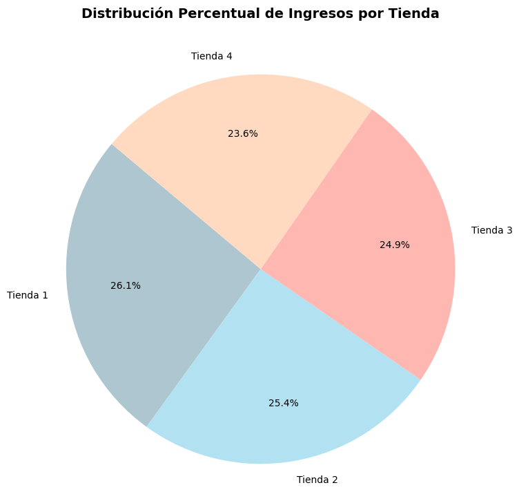
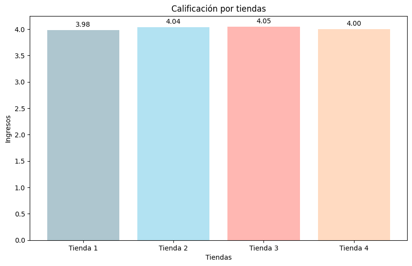
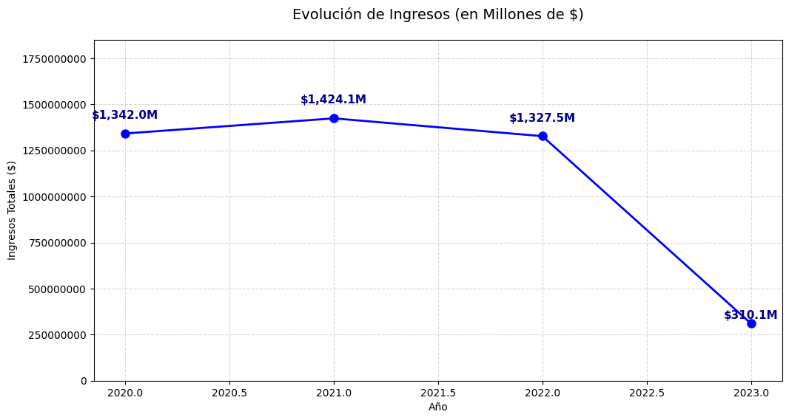

# Análisis de Desempeño para mejorar la inversión en AluraStore Latam

Este proyecto realiza un análisis de datos integral sobre las operaciones de cuatro sucursales de la red **AluraStore**. El objetivo principal es identificar, mediante indicadores clave de desempeño (KPIs), cuál de las tiendas debe ser seleccionada para un proceso de venta o desinversión estratégica, optimizando así el capital del Sr. Juan.

## 📋 Propósito del Proyecto
El análisis busca fundamentar una decisión de negocio basada en datos, evaluando los siguientes pilares:

* **Evolución de ingresos:** Comparativa de facturación anual (2020-2023).
* **Eficiencia logística:** Balance entre volumen de ventas y costos de envío.
* **Satisfacción del cliente:** Promedio de valoraciones por sucursal.
* **Mix de productos:** Identificación de categorías con mayor y menor rotación.

## 🛠️ Estructura del Proyecto
El flujo de trabajo desarrollado en **Google Colab** consta de las siguientes etapas:

1. **Consolidación de Datos:** Unificación de datasets de 4 tiendas distintas mediante `pandas`.
2. **Limpieza y Formateo:** Estandarización de fechas y tratamiento de notación científica para valores financieros elevados.
3. **Análisis Exploratorio (EDA):** Agrupación temporal y por categorías para detectar tendencias de crecimiento o estancamiento.
4. **Visualización:** Creación de gráficos de líneas y barras con `matplotlib` para facilitar la interpretación de los KPIs.
## 📊 Reporte Gráfico y Análisis
<br> 
La tienda con mayor ingresos es:  Tienda 1, con un total de ingresos de:  1150880400.0.<br>
La tienda con menor ingresos es:  Tienda 4, con un total de ingresos de:  1038375700.0.<br>

<br>
La tienda con mejor valoracion promedio es:  Tienda 3, con una valoracion de:  4.05.<br>

<br>
Evolución histórica de ingresos globales de la empresa.
## 🚀 Instalación y Dependencias
Para ejecutar este proyecto, se recomienda un entorno de **Python 3.9 o superior**. Las librerías utilizadas son:

* **Pandas:** Procesamiento y limpieza de datos.
* **Matplotlib:** Generación de visualizaciones.
* **NumPy:** Soporte para operaciones de consolidación.

Puedes instalar las dependencias necesarias ejecutando:

```bash
pip install pandas matplotlib numpy